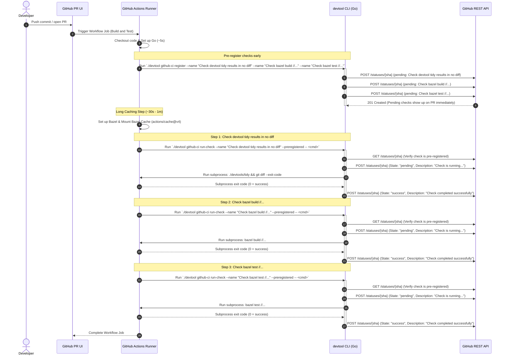

# GitHub Actions CI Workflow Design

This directory contains the GitHub Actions configuration and custom status reporting system for the WebCAD repository.

## Architecture

To minimize build latency and optimize resource usage, all primary validation tasks (checking workspace cleanliness/formatting, and compiling/testing via Bazel) run within a single monolithic job (`Build and Test`). This setup guarantees that the local Bazel cache is shared and reused between steps without needing to duplicate cache download and upload operations over the network.

However, to avoid bundling all verification gates under a single generic status check, this repository uses a custom Go CLI (`./devtool`) to dynamically report granular, labeled status checks to GitHub.

## How Status Checks are Reported

Instead of the Checks API (which does not allow custom names for check runs created via `GITHUB_TOKEN`), this system utilizes the **Commit Statuses API** (`POST /repos/{owner}/{repo}/statuses/{sha}`). 

By using the Statuses API:
1. Status checks are registered and updated dynamically under custom names (like `Check devtool tidy results in no diff`, `Check bazel build //...`, and `Check bazel test //...`).
2. Each check has a direct link pointing back to the GHA workflow job logs (`TargetURL`).
3. External PRs from public forks (where `GITHUB_TOKEN` is read-only) are handled gracefully (the CLI outputs a warning and exits 0 instead of failing the build step).

---

## Sequence Diagram



---

## CLI Usage

### 1. Pre-register pending status names early:
```bash
./devtool github-ci register --name "Check devtool tidy results in no diff" --name "Check bazel build //..." --name "Check bazel test //..." --sha "<commit-sha>"
```

### 2. Execute a command and update status:
```bash
./devtool github-ci run-check --name "Check devtool tidy results in no diff" --sha "<commit-sha>" --preregistered -- ./devtools/tidy && git diff --exit-code
```
