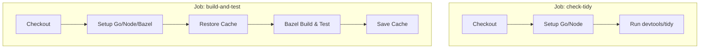
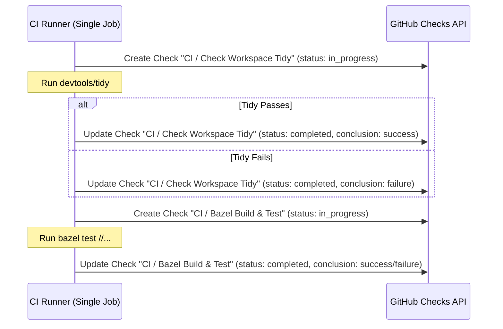

# Design Document: CI Check Granularity and Cache Efficiency

**Author**: Antigravity (powered by Claude Sonnet 4.6)
**Date**: July 5, 2026

---

## Background

Our current GitHub Actions continuous integration (CI) workflow is defined in [ci.yml](file:///home/red/.gemini/antigravity/worktrees/webcad/relax-solver-timeout-threshold/.github/workflows/ci.yml) as a single monolithic job (`build-and-test`). This job performs two primary verification tasks sequentially:
1.  **Check Workspace Tidy**: Runs `./devtools/tidy` and checks for unstaged file modifications.
2.  **Bazel Build and Test**: Compiles all targets and executes all test suites via Bazel.

Because these tasks run as steps within the same job, GitHub reports a single unified status check on the pull request: `CI / Build and Test (pull_request)`. If the tidy check fails (e.g., due to an updated lockfile or missing Gazelle run), developers must click through to the GitHub Actions console to diagnose the failure[^1].

---

## Goals

1.  **Granular Status Reporting**: Report distinct statuses for the tidiness check and the compilation/test runs directly on the GitHub PR checks interface.
2.  **Cache Efficiency**: Maximize the reuse of the Bazel repository and disk caches. Avoid duplicating the download and upload overhead of these caches across separate concurrent virtual machines.
3.  **Low Latency**: Keep total CI execution time as short as possible.

---

## Proposed Options

### Option 1: Split into Separate GitHub Actions Jobs

In this approach, the monolithic `build-and-test` job is split into two independent workflow jobs: `check-tidy` and `build-and-test`.

*   **How it works**: GitHub Actions automatically registers each job as a separate check run on the PR.
*   **Pros**:
    *   Trivial implementation (pure YAML changes).
    *   No custom scripts or specialized permissions required.
*   **Cons**:
    *   **Inefficient Caching**: The Bazel cache (both repository cache and disk cache) is large. Having two parallel jobs means both must download the cache archive at startup.
    *   **Resource Overhead**: Spins up two virtual machines, increasing GitHub runner minute usage.

---

### Option 2: Single Job with Dynamic Check Runs via GitHub API (Recommended)

Keep all verification steps inside a single GitHub Actions job, but use the GitHub REST API[^2] to dynamically register separate status checks during execution.

*   **How it works**:
    1.  The workflow's `GITHUB_TOKEN` is granted `checks: write` permissions.
    2.  At the beginning of each step, a script invokes `curl` (or `actions/github-script`) to create a check run.
    3.  When the step completes, the script updates the check run with the final status.
*   **Pros**:
    *   **Hot Cache Preservation**: Since all steps run sequentially on the exact same virtual machine, the Bazel output base and disk caches remain local on disk[^3]. No double-download or double-upload overhead.
    *   **Granular Status**: Displays distinct, clickable check items directly in the PR merge box.
*   **Cons**:
    *   Requires writing a helper shell script or using a third-party GitHub action to interact with the GitHub API.
    *   Requires explicit permission configuration in the workflow YAML.

---

### Option 3: Sequential Job Chaining (Tidy first, then Build)

Run `check-tidy` as a lightweight job. Only if it succeeds, trigger the heavy `build-and-test` job.

*   **How it works**: Use the `needs: check-tidy` parameter on the `build-and-test` job.
*   **Pros**:
    *   Saves runner minutes: If the tidy check fails (which takes < 10 seconds), the heavy Bazel build and test suite is never started.
*   **Cons**:
    *   Increases wall-clock time for healthy PRs: The build job cannot run in parallel with the tidy check.

---

## Recommendation

We recommend **Option 2 (Single Job with Dynamic Check Runs)**. It offers the best balance: it keeps the developer feedback loop fast by preserving a hot local cache and avoiding double-cache downloads, while providing the clear, granular status reporting on the PR page that developers need.

---

[^1]: This increases friction during code review, especially for minor errors like forgot-to-run-tidy.
[^2]: See the [GitHub Checks API Documentation](https://docs.github.com/en/rest/checks/runs).
[^3]: Sharing the filesystem dynamically within the runner is significantly faster than packaging and uploading cache archives over the network.
