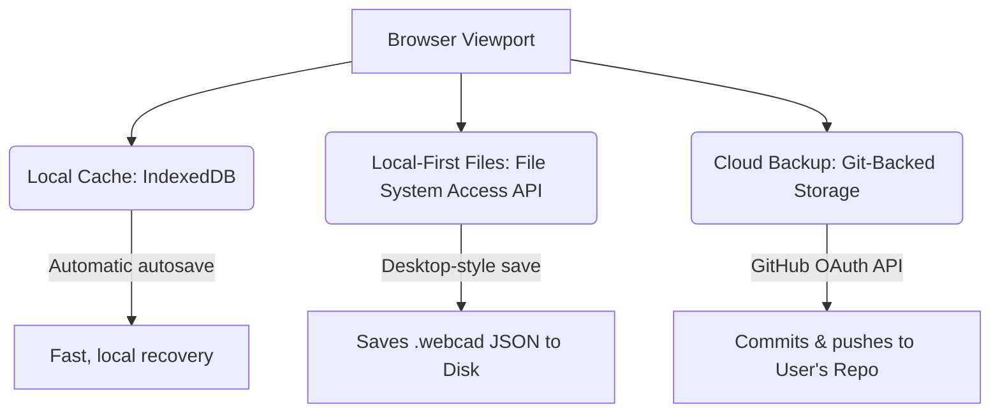

# Design: document storage in a serverless web application

This document evaluates strategies for persisting user designs (sketches, constraint trees, and 3D parameters) in a serverless WebCAD application hosted on static hosting like GitHub Pages (`github.io`), without relying on a dedicated backend server.

---

## 1. The challenge of serverless storage

To keep the application light, cost-effective, and serverless, we want to run the GCS and UI entirely in the user's browser. However, a static site cannot write directly to a server-side database. 

We need a storage mechanism that satisfies the following product requirements:
1. **Durability**: Designs must not be lost if the user clears their browser cache or history.
2. **Access and Portability**: Users should be able to open their designs on different devices.
3. **History/Versioning**: Sketches change frequently; tracking changes and rolling back is extremely useful for CAD workflows.

---

## 2. Evaluated storage strategies

We evaluate three key browser-side storage strategies below.

### 2.1. Local Cache: IndexedDB
IndexedDB is a low-level API for client-side storage of significant amounts of structured data.

*   **How it works**: The app automatically saves the current active design state into the browser's IndexedDB on every change or at regular intervals (autosave).
*   **Pros**:
    *   Zero user configuration or login required.
    *   Large storage capacity (hundreds of megabytes).
    *   Immediate, low-latency writes.
*   **Cons**:
    *   **Not durable**: If the user clears site data, uses incognito mode, or runs out of system storage, the browser may delete the database.
    *   **Isolated**: Designs are locked to the specific browser and device where they were created.

### 2.2. Local-First: File System Access API
The File System Access API allows web applications to read or save changes directly to files and folders on the user's device.

*   **How it works**: When the user clicks "Save," the browser prompts them to select a file path (e.g., `bracket.webcad`). Once permission is granted, the app can read from and write directly to that local file.
*   **Pros**:
    *   **Highly durable**: Data is written directly to the user's hard drive, outside the browser cache boundary.
    *   **Desktop feel**: Behaves like a native desktop app.
    *   **Git-friendly**: The saved files (structured JSON) can be managed by the user using their local Git tools.
*   **Cons**:
    *   Requires explicit user permission prompts.
    *   Limited browser support on mobile viewports (e.g., iOS Safari).

### 2.3. Cloud-Backed: Git-backed storage (Recommended)
Since the application is hosted on GitHub Pages, we can leverage GitHub itself as a distributed, version-controlled database for user files.

*   **How it works**:
    1.  **Authentication**: The user logs in via GitHub OAuth (or inputs a Personal Access Token).
    2.  **Repo Selection**: The user selects or creates a repository (e.g., `my-webcad-designs`).
    3.  **Client-Side Commits**: As the user edits, the app commits the JSON files directly to their repository using the [GitHub REST API (Repository Contents)](https://docs.github.com/en/rest/repos/contents).
*   **Pros**:
    *   **Perfect durability**: Data is safely backed up in the cloud.
    *   **Zero-cost database**: GitHub hosts the repository for free.
    *   **Collaborative**: Built-in access to Git's features (version history, branching, diffing, and merging).
    *   **Collaboration ready**: Multi-user sharing is supported by simply sharing access to the repository.
*   **Cons**:
    *   Requires the user to have a GitHub account.
    *   Requires internet connectivity to save (though can fall back to IndexedDB when offline).

---

## 3. Proposed implementation architecture

We recommend a **hybrid local-first and Git-backed workflow**:

1.  **Active Workspace (IndexedDB)**: The immediate drawing state is constantly cached in IndexedDB. If the browser crashes, the user can recover their unsaved session immediately.
2.  **Desktop Save (File System API)**: Allow users to export and load local `.webcad` JSON files.
3.  **Git Sync (GitHub REST API)**: Provide a "Sync with GitHub" panel. When enabled:
    *   Saving creates a new commit in the user's designated repository.
    *   The commit message can be auto-generated (e.g., `sketch: update circle constraints`) or entered by the user.
    *   The app displays the commit log, allowing the user to select and load older versions of their design.

This design gives the user full ownership of their data with no server cost or storage liability for WebCAD.
