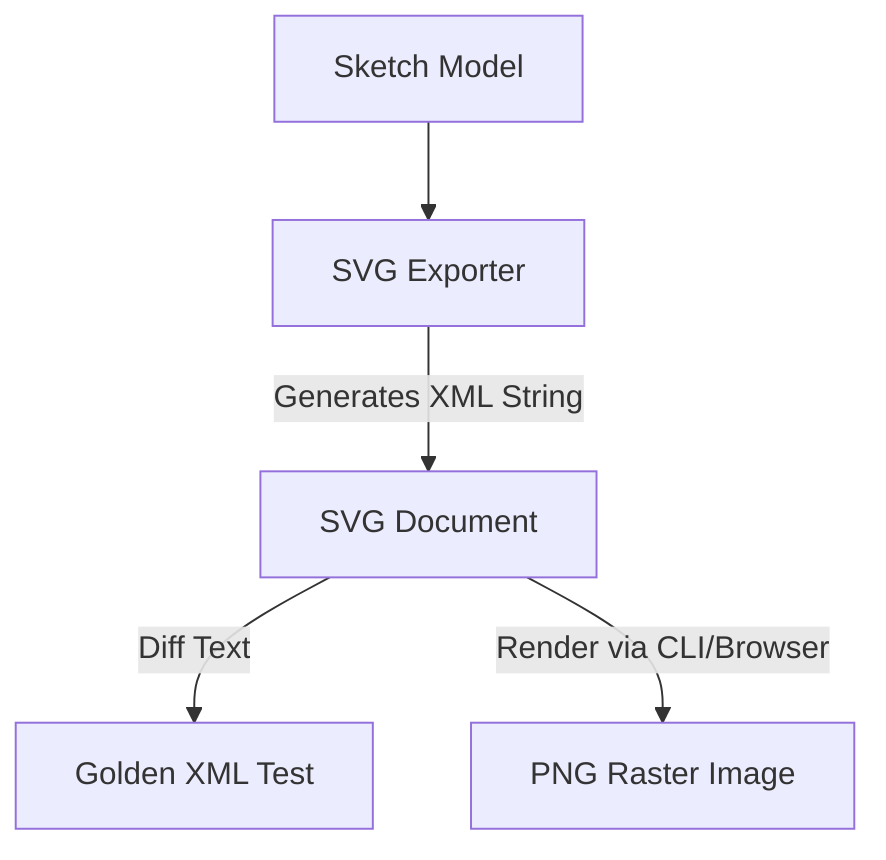

# Design Document: Image Rasterization and Visual Regression Testing in WebCAD

**Date**: July 5, 2026  
**Author**: Antigravity Agent, version 1.0 (powered by Gemini 1.5 Pro)

This document explores how we can run the canvas image rasterization function (the feature) and verify visual layouts (golden testing) in a testing environment, introducing E2E visual regression testing to WebCAD.

---

## The Challenge

Our current image rasterization function (`exportToRasterImage`) relies on the **HTML5 Canvas 2D Context API** via the Konva library. 
* Under the hood, Konva uses `document.createElement('canvas')` and its 2D context drawing commands.
* The Node.js test runner runs in **JSDOM**, which is a pure-JavaScript emulation of the DOM. JSDOM does **not** implement the HTML5 Canvas graphics engine.
* Calling canvas-dependent methods in JSDOM returns transparent or empty stubs (`data:,`), making pixel-perfect visual testing impossible out-of-the-box.

---

## Proposed Approaches

We explore three main architectural solutions to enable testing of the image rasterizer.

### Idea 1: Pure SVG Exporter (Hermetic & Lightweight)
Instead of relying on Canvas pixels, we write a pure TypeScript utility to serialize the sketch geometry into a vector **SVG (Scalable Vector Graphics)** string.



*   **How it works**:
    1. Loop through `points`, `lines`, and `circles` in the workspace.
    2. Format them into standard XML tags (e.g. `<line x1=".." y1=".." x2=".." y2=".." stroke="black" />`).
    3. Output the SVG text string.
*   **Testing**: Since SVG is plain text, JSDOM can verify it perfectly using standard string/XML assertions, without any graphics dependencies.
*   **Pros**:
    *   No C++ binary or browser dependencies.
    *   Vector format is perfect for CNC/vector scaling.
    *   Runs instantly in any pure Node.js test suite.
*   **Cons**:
    *   We have to maintain a separate SVG translation loop alongside the Konva canvas rendering.

#### Subsection: Converting SVG to Raster PNG
If we use an SVG exporter, we can still generate raster PNGs using several off-the-shelf and browser-native strategies:

1.  **Browser-Native Canvas Bridge**:
    *   *How it works*: Convert the SVG string to a data URL (`data:image/svg+xml;utf8,...`), load it into an HTML `Image` object, wait for the `onload` event, draw the image onto a standard canvas:
        ```typescript
        const img = new Image();
        img.src = 'data:image/svg+xml;base64,' + btoa(svgString);
        img.onload = () => {
            const canvas = document.createElement('canvas');
            canvas.getContext('2d')?.drawImage(img, 0, 0);
            const pngDataUrl = canvas.toDataURL('image/png');
        };
        ```
    *   *Evaluation*: Zero extra library weight, natively supported in all modern browsers. Under pure JSDOM, this step returns empty stubs, but if the JSDOM test environment is configured with a 3rd-party canvas backend (like the `canvas` package detailed in Idea 2), this native code path will execute and produce valid PNG buffers transparently inside Node.js.
2.  **Pure JavaScript SVG Rasterizers (e.g., Canvg)**:
    *   *How it works*: Import an npm library like `canvg` (Canvas SVG parser and renderer). It parses the SVG XML and draws it onto a canvas using standard Canvas 2D calls.
    *   *Evaluation*: Works in Node if JSDOM is backed by `node-canvas`. Useful for server-side rasterization.
3.  **WASM-based Renderers**:
    *   *How it works*: Use a WebAssembly-compiled rendering engine to parse the SVG and output raw PNG pixel buffers completely in memory.
    *   *Options*:
        *   `@resvg/resvg-wasm`: WebAssembly port of the Rust `resvg` library. It is exceptionally fast and has the most rigorous compliance with the SVG 1.1 specification.
        *   `@thorvg/thorvg-wasm`: WebAssembly bindings for `ThorVG` (written in C++). Highly optimized for vector animations (like Lottie) and extremely small footprint.
        *   `canvg` + `canvas-wasm`: Run `canvg` inside Node.js using a WebAssembly-based canvas backend (such as a Skia-WASM canvas implementation) instead of native Node-Canvas.
    *   *Evaluation*: Completely independent of JSDOM and standard DOM/Canvas APIs, meaning these libraries work 100% inside raw Node.js/JSDOM environments.

---

### Idea 2: Node-Canvas Integration in JSDOM (Headless Node Graphics)
We integrate the `canvas` npm package (Node bindings to the Cairo graphics library) into our JSDOM test runner.

*   **How it works**:
    1. Add the `canvas` package to `package.json`.
    2. JSDOM automatically detects `canvas` and hooks it into `HTMLCanvasElement.prototype.getContext`, enabling full pixel rendering in Node.
    3. Konva will automatically use this backend when running in Node.
*   **Testing**: We run `exportToRasterImage()`, grab the base64 PNG buffer, and do a byte-by-byte or pixel diff against a `.png` file stored in source control.
*   **Pros**:
    *   Tests the exact same Konva canvas code path that runs in the browser.
    *   No custom serialization logic needed.
*   **Cons**:
    *   Native binary dependency (requires Cairo, Pango, and libpng to compile and run on the host environment).
    *   Can introduce cross-platform rendering diffs (e.g., text anti-aliasing differences between Linux CI and macOS developer machines).

---

### Idea 3: Headless Browser E2E Testing via Playwright (Hermetic & Production-Grade)
We introduce Playwright (or Puppeteer) to run tests inside a real headless Chrome browser container managed by Bazel.

*   **How it works**:
    1. A Bazel target boots the WebCAD server.
    2. Playwright launches headless Chrome, navigates to the page, loads a sketch, and triggers screenshot capture.
    3. Playwright compares the captured screenshot with a golden PNG using standard screenshot matchers (`expect(page).toHaveScreenshot()`).
*   **Pros**:
    *   Runs the actual production code in a real browser engine (Blink/V8).
    *   Handles layout, CSS styling, grids, and Konva layers accurately.
*   **Cons**:
    *   Heavyweight framework setup.
    *   Slower test execution times than pure Node unit tests.

---

## Test Structure in WebCAD

To prevent E2E browser tests from slowing down developer loops, we strictly decouple tests into two layers using Bazel directories and naming conventions.

```
web/poc/
├── e2e/
│   ├── BUILD.bazel          # Targets configured as 'e2e' (Playwright)
│   └── screenshot.test.ts   # Golden image visual E2E tests
└── ui/
    └── app/
        └── viewport/
            ├── BUILD.bazel  # Targets configured as 'unit' (Node/JSDOM)
            └── viewport.component.test.ts
```

1.  **Unit Tests (`js_test` in Bazel)**:
    *   *Location*: Co-located with source components (e.g., `web/poc/ui/app/.../*.test.ts`).
    *   *Environment*: Headless Node.js + JSDOM. Fast, lightweight.
    *   *Restrictions*: Cannot verify raw canvas pixels. Testing focuses on state, workspace math, and user interaction event logic.
2.  **E2E Visual Tests (`playwright_test` in Bazel)**:
    *   *Location*: Kept isolated under `web/poc/e2e/`.
    *   *Environment*: Headless Chromium container.
    *   *Restrictions*: Kept separate from regular CI build-and-test runs, triggered only on specific commits, staging deploys, or manually via `bazel test //web/poc/e2e/...`.

---

## Recommendation

For a robust, scalable CAD system, we recommend a hybrid approach:
1.  **Idea 1 (SVG Exporter)**: Implement a lightweight SVG exporter in TypeScript for standard drawing exports and quick text-based visual regression tests.
2.  **Idea 3 (Playwright)**: Setup Playwright in Bazel for high-level UI component and integration verification (including dark/light theme checks).

---

## Appendix: Pulling Heavy Playwright Dependencies Hermetically in Bazel

To avoid downloading large browser binaries during Bazel builds, we fetch hermetic, platform-specific browser toolchains via `MODULE.bazel`:

1.  **Register Playwright Bazel Rules**:
    In `MODULE.bazel`, import the rules and configure the hermetic browser downloads:
    ```starlark
    bazel_dep(name = "aspect_rules_js", version = "1.34.0")
    
    # Configure playwright hermetic browsers
    playwright = use_extension("@aspect_rules_js//js:extensions.bzl", "playwright")
    playwright.configure(
        name = "playwright",
        chromium = True, # Only download Chromium to minimize footprint
    )
    use_repo(playwright, "playwright_browsers")
    ```
2.  **Bazel E2E Target configuration**:
    Configure the test targets under `web/poc/e2e/BUILD.bazel` to depend on the fetched hermetic browsers:
    ```starlark
    load("@aspect_rules_js//js:defs.bzl", "js_test")

    js_test(
        name = "screenshot_test",
        srcs = ["screenshot.test.ts"],
        data = [
            "//web/poc:poc", # WebCAD server
            "@playwright_browsers//:chromium", # Hermetic chromium binary
        ],
        env = {
            "PLAYWRIGHT_BROWSERS_PATH": "$(rootpath @playwright_browsers//:chromium)",
        },
    )
    ```
This ensures the visual tests run consistently and hermetically across developer workstations and CI agents without any ad-hoc downloads.

---

## Appendix B: Background & Concept Primer

For developers unfamiliar with modern visual testing and containerized build tooling, here is a summary of the core concepts referenced in this document:

### Playwright
[Playwright](https://playwright.dev/) is an open-source framework developed by Microsoft for web application end-to-end (E2E) testing. It allows developers to control modern rendering engines (Chromium, Firefox, WebKit) via a clean API. Unlike mock DOMs, Playwright runs tests inside actual browser processes, making it the industry standard for capturing pixel-perfect screenshots and testing visual layouts.

### JSDOM
[JSDOM](https://github.com/jsdom/jsdom) is a pure-JavaScript implementation of the Web standards (specifically the HTML, DOM, and Event APIs) designed to run inside Node.js. It simulates a browser environment so that frontend frameworks (like Angular or React) can be tested in standard command-line environments without launching a real browser. However, because it is written entirely in JavaScript, it lacks rendering engines for advanced visual elements like WebGL and HTML5 Canvas.

### Cairo Graphics & Node-Canvas
[Cairo](https://www.cairographics.org/) is a 2D graphics library with support for multiple output devices (including image buffers, PDF, SVG, and PostScript). [Node-Canvas](https://github.com/Automattic/node-canvas) is a Node.js wrapper around Cairo that brings standard HTML5 Canvas API compatibility to Node.js environments. It compiles Cairo as a native C++ addon to let JSDOM process drawing commands.

### WebAssembly (WASM)
[WebAssembly](https://webassembly.org/) is a binary instruction format for a stack-based virtual machine. It is designed as a portable target for compilation of high-performance languages like C, C++, and Rust, enabling deployment on the web and client/server applications at near-native speed. In testing, WASM lets us run native C++/Rust rendering engines directly inside Node.js without requiring host-level C++ compilers.
