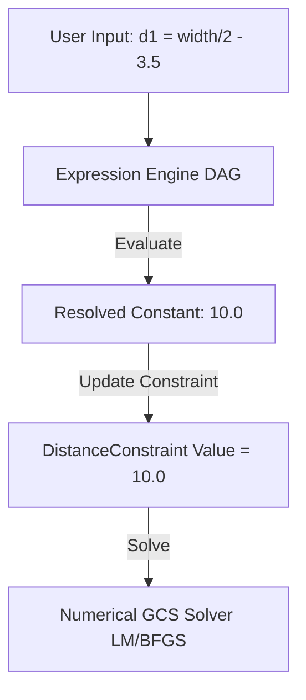

# Research: Parametric Expression Handling in CAD Solvers

A key architectural question in Geometric Constraint Solvers (GCS) is how they handle mathematical expressions (e.g., `d1 = width / 2 - 3.5in`) alongside geometric constraints. 

In theory, one could feed arbitrary algebraic equations directly into a simultaneous numerical solver (like LM or BFGS) by treating all variables as degrees of freedom and the equations as additional constraints. In practice, however, almost all major CAD programs decouple **expression evaluation** from **geometric constraint solving**.

They implement a two-stage pipeline:
1.  **Expression Engine (DAG Evaluator)**: Resolves user variables and formulas sequentially.
2.  **Geometric Solver (GCS)**: Solves the geometric relationships using the resolved static values.

---

## Comparison of CAD Systems

### 1. Onshape
*   **Mechanism**: Onshape uses **Variables** (local or via Variable Studios) and **Expressions** to drive dimensions.
*   **Evaluation**: The expression engine evaluates formulas sequentially based on their order in the feature tree. You can reference previous variables or dimensions to calculate a new value (e.g., `#chord * 0.1` or `table_height / 2 - 3.5in`).
*   **Limits**: Circular dependencies are strictly forbidden and flagged as errors in the feature tree. The GCS (sketch solver) does not solve the equations; it only receives the evaluated constant floats.

### 2. SolidWorks
*   **Mechanism**: SolidWorks uses the **Equations Manager** to define relationships between dimensions and global variables.
*   **Evaluation**: Like Onshape, this is a sequential evaluation. SolidWorks provides an "Ordered View" in the Equations Manager to visualize and resolve the calculation sequence.
*   **Limits**: Circular references (e.g., `A = B + 2` and `B = A * 0.5`) are not supported natively and result in errors. For complex simultaneous algebraic systems, SolidWorks integrates with **Excel Design Tables**, using Excel's solver to resolve the math externally before updating the CAD model.
*   **Equation-Driven Curves**: SolidWorks supports plotting geometry directly from functions (e.g., $y = x^2$), but these are generated explicitly rather than solved implicitly as part of the GCS.

### 3. Autodesk AutoCAD
*   **Mechanism**: AutoCAD features a **Parameters Manager** for managing dimensional constraints and user-defined variables.
*   **Evaluation**: Formulas can use basic operators, parentheses, and standard functions (`sqrt`, `sin`, `log`, etc.).
*   **Limits**: Circular dependencies are blocked. If a loop is detected, AutoCAD flags it with an error ("A dependent expression cannot be evaluated"). The constraint solver only operates on the resolved constant values.

### 4. Autodesk Revit
*   **Mechanism**: Revit uses **Family Parameters** and formulas to drive parametric BIM families.
*   **Evaluation**: Formulas are evaluated sequentially. Revit separates "driving" parameters (user inputs) from "driven" parameters (formula results) to prevent loops.
*   **Limits**: Revit is very sensitive to circular chains of references (e.g., constraining geometry to a reference plane that is also driven by the geometry's size). It triggers a "Circular chain of references" error and forces the user to decouple the parameters.

### 5. SketchUp (Dynamic Components)
*   **Mechanism**: SketchUp does not have a native geometric constraint solver. Instead, it supports parametric behavior via **Dynamic Components** using attributes and formulas.
*   **Evaluation**: Attributes (like size `LenX` or position `X`) are driven by formulas referencing other attributes.
*   **Limits**: Evaluation is strictly sequential (DAG). If you need complex simultaneous solving, you must use node-based third-party plugins like **Viz Pro** (similar to Rhino's Grasshopper), which still operate as a DAG of geometric construction operations.

---

## Architectural Implications for `webcad`

This survey confirms that **we do not need to support simultaneous equation solving within the numerical GCS engine** (LM/BFGS) to support parametric expressions.

Instead, the recommended architecture is:

### Recommended Workflow:
1.  **De-coupled Pre-processor**: Implement a simple expression parser and Directed Acyclic Graph (DAG) evaluator in Go (external to the GCS).
2.  **Resolution Step**:
    *   The user inputs an expression for a constraint (e.g., `distance = #width * 0.5`).
    *   Before solving, the pre-processor evaluates `#width * 0.5` to a float (e.g., `10.0`).
    *   The pre-processor updates `DistanceConstraint.Value = 10.0`.
    *   The GCS (LM or BFGS) runs using `10.0` as the target distance.
3.  **Benefits**:
    *   **Simplicity**: Keeps the solver code clean and focused on geometry.
    *   **Performance**: Avoids the $O(N \times M)$ overhead of computing numerical derivatives for complex arbitrary formula strings inside the solver loop.
    *   **Consistency**: Aligns with how major commercial CAD tools handle parametric modeling.

---

## Alternative Approach: Implicit Solving of Expressions in GCS

While commercial CAD systems favor a decoupled DAG-first pipeline, it is mathematically possible to solve algebraic expressions and geometric constraints **simultaneously** within the GCS engine. This would enable advanced features like **driven (reference) dimensions** participating in feedback loops.

### 1. Implementation via Measurement Constraints
To allow a dimension (e.g., the distance between two points) to act as a variable in an expression that drives other geometry, we can extend the GCS system:

*   **Introduce Algebraic Variables**: Add non-geometric variables to the optimization vector $x$ (e.g., $x_{\text{chord}}$, $x_{\text{scale}}$, $x_{\text{width}}$).
*   **Measurement Constraints**: Add constraints that "measure" geometry and bind the value to an algebraic variable.
    $$C_{\text{measure}}(p_1, p_2, x_{\text{chord}}) = \text{distance}(p_1, p_2) - x_{\text{chord}} = 0$$
*   **Algebraic Relation Constraints**: Add the user's expression as a mathematical constraint linking the variables.
    $$C_{\text{algebraic}}(x_{\text{chord}}, x_{\text{scale}}, x_{\text{width}}) = x_{\text{width}} - (x_{\text{chord}} \times x_{\text{scale}}) = 0$$
*   **Driving Constraints**: Use the driven variable $x_{\text{width}}$ to drive another geometric constraint.

The solver (LM/BFGS) will solve all geometric coordinates and algebraic variables simultaneously in one optimization pass.

### 2. Supporting Expressions with Analytical Derivatives
To maintain high performance and avoid numerical Jacobian approximation, we can support a set of mathematical expressions by predefining their analytical derivatives:

*   **Supported Operators**: Limit expressions to basic operations (e.g., $+$, $-$, $\times$, $/$, $x^n$).
*   **Chain Rule Evaluation**: Implement the chain rule in the constraint evaluator. For example, if a constraint is $C(x, y) = f(g(x, y)) = 0$:
    $$\frac{\partial C}{\partial x} = f'(g(x,y)) \times \frac{\partial g}{\partial x}$$
*   **Precomputed Gradients**: Write explicit Go evaluators for common parametric templates:
    *   Linear combination: $w = a \cdot u + b \cdot v$ (derivatives are constants $a$ and $b$).
    *   Proportional scaling: $w = u \cdot v$ (derivatives are $v$ and $u$).

### Trade-offs
*   **Pros**: Enables bidirectional relationships (geometry driving expressions, which in turn drive other geometry).
*   **Cons**: Increases solver dimensionality and complexity. Stiff algebraic constraints can degrade solver convergence compared to a clean DAG pre-evaluation.

