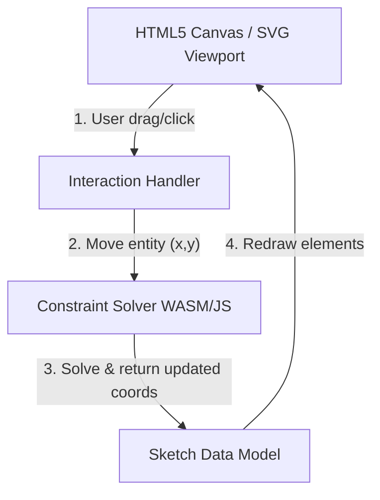

# Web-Based 2D Drawing and Geometric Constraint Solving Frameworks

This report evaluates technical options for implementing a parametric 2D sketcher in a web browser. The target workflow is inspired by the sketching mechanics found in industry desktop CAD software (like SolidWorks or FreeCAD), where users draw shapes (lines, circles, arcs, curves) and apply geometric constraints that the engine solves dynamically in real-time. Additionally, we consider the future path toward 3D modeling and the generation of technical drawings (blueprints) from those models.

---

## 1. Core Architectural Components of a Web CAD Sketcher

A web-based parametric sketcher requires three main subsystems working in harmony:
1. **Interactive Viewport (Rendering & Interaction)**: Captures mouse/touch inputs, handles pan/zoom, draws grid systems, rendering shapes, and managing selection states.
2. **Geometric Constraint Solver (Mathematics Engine)**: Stores the state of the sketch (coordinates, constraints) and computes the valid positions of all geometry whenever an edit occurs.
3. **Data Model & Command Manager**: Maintains the document history tree, handles Undo/Redo, and manages the serializable representation of the sketch.

---

## 2. Web-Compatible Geometric Constraint Solvers

Solving non-linear geometric constraints is mathematically intensive. The choice of solver backend directly impacts performance and stability.

### 2.1. Planegcs (WebAssembly Port of FreeCAD Solver)
*   **Overview**: [planegcs](https://github.com/Salusoft89/planegcs) is a C++ to WebAssembly (WASM) compilation of FreeCAD's native geometric constraint solver, complete with TypeScript bindings.
*   **Pros**:
    *   **Battle-tested**: Inherits years of development and optimization from the FreeCAD community.
    *   **High Performance**: Compiled C++ runs near native speeds in the browser.
    *   **Advanced Capabilities**: Supports points, lines, circles, arcs, ellipses, and complex curves, along with constraints like tangency, symmetry, perpendicularity, and formula-based dimensions.
*   **Cons**:
    *   Slightly larger initial download size due to the WASM binary.
    *   Interfacing between JavaScript memory and WASM requires a serialization/deserialization boundary.

### 2.2. JSketcher Solver (Native JavaScript/TypeScript)
*   **Overview**: The solver module of [JSketcher](https://github.com/xibyte/jsketcher), a native browser parametric CAD application.
*   **Pros**:
    *   Written in pure JavaScript, allowing for direct debugger access and zero assembly build steps.
    *   Specifically optimized for web usage, matching the user interaction loop of standard browser applications.
*   **Cons**:
    *   May exhibit lower performance than WebAssembly-based compiled C++ for highly complex sketches containing hundreds of interrelated constraints.

### 2.3. Protractr GCS (Native TypeScript)
*   **Overview**: A modular geometric constraint solver module (`gcs`) developed for [Protractr](https://github.com/n-wach/protractr), a 2D sketch editor designed to mimic SolidWorks.
*   **Pros**:
    *   Clean, object-oriented TypeScript API.
    *   Very easy to customize, inspect, and extend with new geometric primitives.
*   **Cons**:
    *   Mainly suitable for 2D sketches and may require significant re-engineering if we attempt to solve complex 3D constraints directly in the solver module later.

### 2.4. ezpz (Rust compiled to WebAssembly)
*   **Overview**: Developed by KittyCAD (`ezpz`), this is a modern geometric constraint solver written in Rust and compiled to WASM.
*   **Pros**:
    *   Strong memory safety guarantees and excellent performance.
    *   Modern design, accommodating Web-first CAD requirements.
*   **Cons**:
    *   Relatively young compared to FreeCAD's solver; may have fewer edge-case optimizations for complex constraint conflicts.

---

## 3. Interactive 2D Rendering and Vector Frameworks

The rendering layer displays the shapes and handles click/drag gestures. We must choose between HTML5 Canvas (raster rendering) and SVG (vector DOM elements).

### 3.1. Konva.js (HTML5 Canvas Framework)
*   **Best For**: High-performance interactive viewports.
*   **How it works**: Wraps the 2D Canvas context in an object-oriented scene graph. You can create shapes (`Konva.Line`, `Konva.Circle`), attach event listeners (`dragmove`, `click`), and handle zoom/pan smoothly.
*   **Why choose it**: Canvas performs exceptionally well when drawing hundreds of constraints, dimension lines, and construction lines. It easily handles 60 FPS dragging.

### 3.2. Paper.js (Vector Graphics Scripting)
*   **Best For**: Advanced vector geometry.
*   **How it works**: Uses HTML5 Canvas but provides a robust vector mathematics engine. It is renowned for path geometry calculations, such as boolean operations (union, intersection, subtraction) and finding path intersections.
*   **Why choose it**: If our drawing app needs to do complex geometry operations locally (e.g., trimming lines, offsetting profiles, or hatching areas), Paper.js provides the math tools natively.

### 3.3. Fabric.js (Canvas Object Model)
*   **Best For**: General-purpose interactive vector editors.
*   **Why choose it**: Highly mature with built-in selection boxes, controls, and SVG import/export.
*   **Why not**: It is designed more for graphic design (like Canva or Illustrator) rather than CAD, so setting up precise snapping, grids, and CAD-style dimensioning lines requires custom extensions.

### 3.4. SVG & D3.js (Direct DOM Vectors)
*   **Best For**: High-fidelity technical drawings and annotations.
*   **How it works**: Renders vector paths directly in the HTML DOM.
*   **Why choose it**: Text rendering, CSS styling, and interactivity are built-in. It is ideal for the **Technical Drawing (Drafting)** stage where we place dimensions, text, labels, and drawing templates (title blocks).
*   **Why not**: High DOM count can slow down interactive dragging during active 2D sketching.

---

## 4. Path to 3D Extrusion and Technical Drawings

A critical requirement is that our 2D sketches can serve as the foundation for 3D modeling and subsequent 2D blueprint layouts.

### 4.1. Transitioning to 3D (Extrusion & Revolve)
To go from a 2D sketch to 3D:
1. **Renderer**: Transition the viewport to a 3D context using **Three.js** (WebGL/WebGPU). Three.js can take a 2D shape path (constructed from solved sketch points) and extrude it into a 3D mesh (`Three.ExtrudeGeometry`).
2. **Modeling Kernel**: To perform true 3D CAD operations (fillets, boolean cuts, drafts), a Boundary Representation (B-Rep) kernel is required.
   - **OpenCASCADE WebAssembly** (e.g., via `cascade-studio` or `occt-import-js`): The industry standard open-source CAD kernel compiled to WASM. It enables high-fidelity 3D CAD modeling directly in the browser.
   - **JSCAD**: A simpler, code-driven solid modeler that performs Constructive Solid Geometry (CSG) operations.

### 4.2. Creating 2D Technical Drawings (Drafting)
Once a 3D part is created (or from the 2D sketch itself), engineers require a **Technical Drawing** or Blueprint view (including orthographic projections, cross-sections, dimensions, text annotations, and borders).
*   **Vector Engine**: **SVG** is the ideal technology for technical drawing sheets. It ensures that text, lines, and dimensions remain perfectly crisp when zoomed or printed.
*   **Dimension Lines and Labels**: We can use libraries like **Maker.js** (developed by Microsoft) to generate standard CAD dimension lines (arrows, extension lines, text centering) programmatically and export them directly to DXF or SVG.
*   **Rich Text Annotations**: Standard HTML/CSS overlays or SVG `<text>` elements permit adding tolerances, welding symbols, and drawing titles with full font support.

---

## 5. TypeScript Integration & Type Safety

Since TypeScript is the required language for the frontend implementation, we must evaluate how well each library integrates with TypeScript's type system:

1. **Planegcs (FreeCAD WASM)**: Provides complete TypeScript bindings and interfaces out of the box, ensuring that calls to the compiled WASM binary are fully type-safe.
2. **Konva.js**: Has native TypeScript support, meaning we get full autocomplete and compile-time checks for all viewport rendering, event handlers, and shapes.
3. **Three.js**: Has extremely mature `@types/three` typings maintained by the community, offering first-class TypeScript support.
4. **OpenCASCADE WASM**: Typings are available or can be auto-generated from the C++ headers via tools like WebIDL, though they require some setup.
5. **Maker.js**: Includes native TypeScript typings.

Using TypeScript will allow us to define rigid type interfaces for geometric entities (e.g., `Point`, `Line`, `Constraint`) that both the rendering viewport and the mathematical solver can understand without type casting.

---

## 6. Proposed Technology Stack Options for WebCAD

Based on the research and the strict requirement for a TypeScript-first frontend, here are three viable paths forward:

### Option A: The Enterprise CAD-Grade Stack (Recommended)
This stack prioritizes performance, mathematical correctness, and industrial CAD capabilities, utilizing mature libraries with excellent TypeScript support.
*   **Language**: TypeScript (100% Type-Safe development).
*   **2D Viewport Rendering**: **Konva.js** (Native TS) for high-performance interactive canvas sketching, switching to **SVG** for technical drafting sheets.
*   **Geometric Solver**: **Planegcs (WASM with TS Bindings)**. Highly mature C++ code running at native speed with type-safe interfaces.
*   **3D Viewport**: **Three.js** (via `@types/three`) for rendering, integrated with **OpenCASCADE WASM** for 3D B-Rep modeling (extruding, chamfering, cutting).
*   **Export Formats**: DXF (via Maker.js with TS typings), SVG, and STEP (via OpenCASCADE).

### Option B: The Pure TypeScript Stack
This stack avoids WebAssembly compilation and third-party binaries, relying entirely on native TypeScript implementations for maximum debuggability.
*   **Language**: TypeScript.
*   **2D Viewport Rendering**: **Paper.js** or **Two.js** (with community types) for 2D geometry operations and interaction.
*   **Geometric Solver**: **Protractr GCS** (written natively in TypeScript) or **JSketcher Solver** (JS/TS).
*   **3D Viewport**: **Three.js** with basic CSG libraries (like `three-csg-ts`) for primitive 3D extrusions.

### Option C: The Rust-WASM Systems Stack
A Rust-centric stack compiled to WebAssembly, communicating with a TypeScript frontend.
*   **Language**: TypeScript on the frontend, Rust on the backend.
*   **Viewport Rendering**: Custom HTML5 Canvas or WebGL layer.
*   **Geometric Solver**: **ezpz (Rust/WASM)** with auto-generated TS bindings via `wasm-bindgen`.
*   **3D Viewport**: **Three.js** or a Rust-based WebGPU renderer (like Bevy UI).

