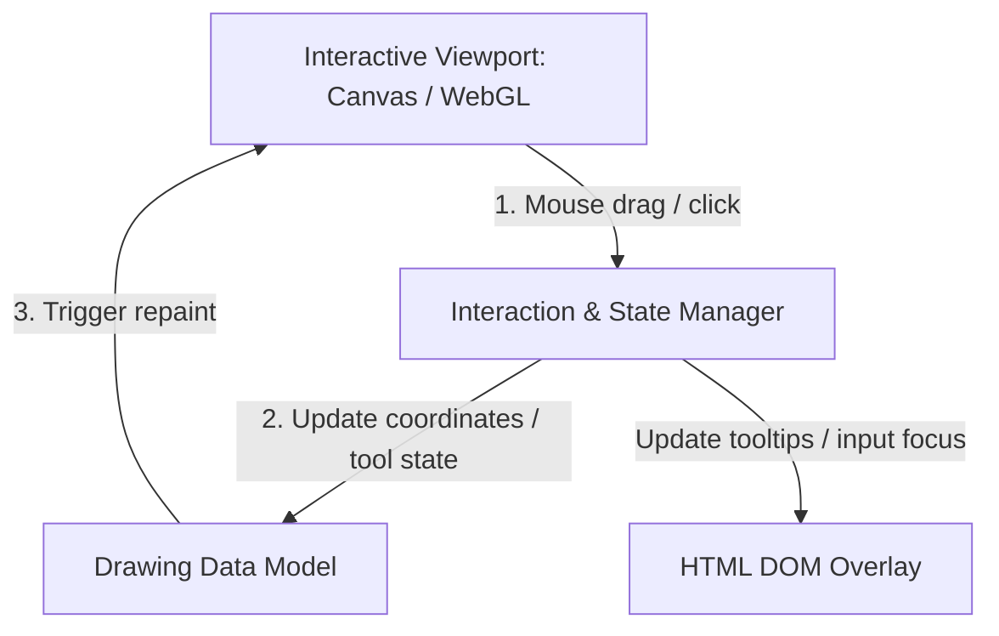

# Web-based 2D drawing and viewport frameworks

This report evaluates technical options for implementing a 2D sketcher viewport in a web browser. The target UI is inspired by the interactive sketching viewports found in industry-standard desktop CAD software, where users draw shapes (lines, circles, arcs, curves) and manipulate them interactively. Additionally, we consider the future path toward 3D rendering and the generation of technical drawing sheets (blueprints) from those models.

---

## 1. Core architectural components of a web CAD viewport

A web-based CAD viewport requires three main client-side subsystems:
1. **Interactive Viewport (Rendering & Event Loop)**: Renders geometric shapes, draws helper grids/snapping guidelines, handles pan/zoom transformations, and captures user input.
2. **Interaction & State Manager**: Manages active drawing tools (e.g., line tool, circle tool, select tool), tracks hover and selection states, coordinates drag gestures, and triggers document modifications.
3. **DOM Overlay (Annotations & UI)**: Positioned on top of the graphics viewport to manage text inputs, contextual menus, tooltips, and collaborative features (such as comments) using native HTML elements.

---

## 2. Low-level browser rendering APIs and primitives

To implement the viewport, we must evaluate the low-level graphics APIs available in modern web browsers, the mathematical primitives they operate on, and their performance characteristics.

### 3.1. API comparison and primitives

| Graphics API | Primitives | Render Mode | Performance | Characteristics |
| :--- | :--- | :--- | :--- | :--- |
| **HTML5 2D Canvas (Canvas2D)** | Points, lines, arcs, circles, Bezier/quadratic curves, text, images. | **Raster (Immediate)**: Commands draw pixels directly into a raster buffer. | **High (2D)**: Hardware-accelerated by browser engines. Easily renders thousands of 2D entities at 60 FPS. | Simple API. Re-rendering is required on zoom/pan to maintain crisp vectors. Text is rasterized and difficult to style or interact with. |
| **WebGL & WebGPU** | Points, straight lines, triangles. | **Raster (Immediate/GPU)**: Translates vertices and shaders directly to the GPU. | **Maximum**: Direct hardware access. Handles millions of primitives, crucial for 3D navigation. | High complexity. WebGPU maps to modern system APIs like **Vulkan** (Windows/Linux), **Metal** (macOS), and **Direct3D 12**. Curves must be tessellated (broken into lines) or drawn using complex mathematical shaders. |
| **SVG (Scalable Vector Graphics)** | `<line>`, `<circle>`, `<path>` (lines, arcs, Beziers), `<text>`. | **Vector (Retained)**: Graphic elements are represented as nodes in the HTML DOM. | **Low (Interactive)**: High DOM counts (>1000 nodes) cause layout reflow and paint bottlenecks. | Resolution-independent (crisp at any zoom). Highly styleable via CSS. Excellent for exporting drawings, but **unsuitable** for active CAD viewport rendering. |
| **HTML DOM Overlay** | `
`, ``, input fields, text elements. | **DOM Document Layout**: Structured HTML elements positioned in the document flow. | **N/A (UI-Only)**: Handled by the browser layout engine. | Ideal for text inputs, menus, tooltips, and **collaborative commenting** systems. Can be easily layered on top of a Canvas viewport. |

### 3.2. Rendering primitives in GCS CAD

*   **Tessellation**: In low-level APIs like WebGL/WebGPU, curved primitives (arcs, circles, splines) do not exist natively. The app must break curves down into a series of short, straight line segments (tessellation) before rendering, or write custom fragment shaders (such as Signed Distance Fields) to render them mathematically.
*   **Resolution Independence**: While SVG handles resolution scaling automatically, Canvas and WebGL/WebGPU viewports must capture zoom events and re-clear/re-render vectors at the new pixel ratio to keep lines from appearing blurry or pixelated.
*   **DOM overlays for interactive components**: For features like commenting, dimension input boxes, and menu anchors, drawing them on a canvas requires writing a custom UI layout and text-wrapping system. Instead, the canonical CAD architecture layers a transparent HTML DOM overlay directly on top of the Canvas/WebGL canvas. This lets the browser handle input focus, CSS text rendering, and DOM positioning while the canvas handles high-performance line drawing.

---

## 4. Interactive 2D rendering and vector frameworks

The rendering layer displays the shapes and handles click/drag gestures. We must choose between HTML5 Canvas (raster rendering) and SVG (vector DOM elements).

### 3.1. Konva.js (HTML5 Canvas framework)
*   **Best for**: High-performance interactive viewports.
*   **How it works**: Wraps the 2D Canvas context in an object-oriented scene graph. You can create shapes (`Konva.Line`, `Konva.Circle`), attach event listeners (`dragmove`, `click`), and handle zoom/pan smoothly.
*   **Why choose it**: Canvas performs exceptionally well when drawing hundreds of constraints, dimension lines, and construction lines. It easily handles 60 FPS dragging.

### 3.2. Paper.js (vector graphics scripting)
*   **Best for**: Advanced vector geometry.
*   **How it works**: Uses HTML5 Canvas but provides a robust vector mathematics engine. It is renowned for path geometry calculations, such as boolean operations (union, intersection, subtraction) and finding path intersections.
*   **Why choose it**: If our drawing app needs to do complex geometry operations locally (e.g., trimming lines, offsetting profiles, or hatching areas), Paper.js provides the math tools natively.

### 3.3. Fabric.js (canvas object model)
*   **Best for**: General-purpose interactive vector editors.
*   **Why choose it**: Highly mature with built-in selection boxes, controls, and SVG import/export.
*   **Why not**: It is designed more for graphic design (like Canva or Illustrator) rather than CAD, so setting up precise snapping, grids, and CAD-style dimensioning lines requires custom extensions.

### 3.4. SVG & D3.js (direct DOM vectors)
*   **Best for**: High-fidelity technical drawings and annotations.
*   **How it works**: Renders vector paths directly in the HTML DOM.
*   **Why choose it**: Text rendering, CSS styling, and interactivity are built-in. It is ideal for the **Technical Drawing (Drafting)** stage where we place dimensions, text, labels, and drawing templates (title blocks).
*   **Why not**: High DOM count can slow down interactive dragging during active 2D sketching.

---

## 4. Path to 3D rendering and technical drawings

A critical requirement is that our 2D sketches can serve as the foundation for 3D display rendering and subsequent 2D blueprint layouts.

### 4.1. Transitioning to 3D rendering
To transition from a 2D sketch to a 3D view:
*   **3D Viewport**: Transition the viewport to a 3D context using **Three.js** (WebGL/WebGPU). Three.js can take 2D shape paths and extrude them into a 3D mesh representation (`Three.ExtrudeGeometry`) for visual confirmation.
*   **Rendering Pipeline**: By sharing coordinates from the 2D layout, the 3D viewport can dynamically reconstruct and display the 3D representation without needing to re-run the 2D interaction loops.

### 4.2. Creating 2D [technical drawings](file:///home/red/ws/webcad/docs/glossary.md#technical-drawing) (drafting)
Once a 3D part is created (or from the 2D sketch itself), engineers require a **[Technical drawing](file:///home/red/ws/webcad/docs/glossary.md#technical-drawing)** or Blueprint view (including orthographic projections, cross-sections, dimensions, text annotations, and borders).
*   **Vector Engine**: **SVG** is the ideal technology for technical drawing sheets. It ensures that text, lines, and dimensions remain perfectly crisp when zoomed or printed.
*   **Dimension Lines and Labels**: We can use libraries like **Maker.js** (developed by Microsoft) to generate standard CAD dimension lines (arrows, extension lines, text centering) programmatically and export them directly to DXF or SVG.
*   **Rich Text Annotations**: Standard HTML/CSS overlays or SVG `<text>` elements permit adding tolerances, welding symbols, and drawing titles with full font support.

---

## 5. TypeScript integration and type safety

Since TypeScript is the required language for the frontend implementation, we must evaluate how well each library integrates with TypeScript's type system:

1. **Konva.js**: Has native TypeScript support, meaning we get full autocomplete and compile-time checks for all viewport rendering, event handlers, and shapes.
2. **Three.js**: Has extremely mature `@types/three` typings maintained by the community, offering first-class TypeScript support for 3D renderings.
3. **Maker.js**: Includes native TypeScript typings for programmatically generating 2D drawing geometries.

Using TypeScript will allow us to define rigid type interfaces for rendering entities (e.g., `Point`, `Line`, `Arc`) that the interactive viewport, the data model, and the export utilities can share without type casting or runtime conversion overhead.

---

## 6. Proposed technology stack options for WebCAD

Based on the research and the strict requirement for a TypeScript-first frontend, here are three viable paths forward for the viewport rendering and user interface architecture (decoupled from the GCS choice):

### Option A: Hybrid Canvas-DOM stack (Recommended)
This stack prioritizes performance, real-time interactivity, and high-fidelity UI overlays like comments.
*   **Language**: TypeScript (100% Type-Safe development).
*   **Interactive Viewport**: **Konva.js** (built on HTML5 Canvas) for drawing grid lines, sketch lines, circles, and dimension constraints, ensuring 60 FPS cursor dragging and pan/zoom response.
*   **UI & Commenting Overlay**: **HTML DOM & CSS** layered directly on top of the Canvas. Positioned using coordinate mapping to render rich text comments, edit tooltips, and dimension input boxes.
*   **3D Viewport**: **Three.js** (WebGL/WebGPU) for displaying extrusions.
*   **Export Formats**: Direct serialization to SVG (for technical drawing prints) and DXF (via Maker.js).

### Option B: Native WebGL/WebGPU stack
A high-performance stack for custom rendering control, suitable if we want custom shader-based anti-aliasing and zero dependency overhead.
*   **Language**: TypeScript.
*   **Interactive Viewport**: Custom **WebGL/WebGPU** renderer. All circles and arcs are tessellated on the CPU or rendered on the GPU using fragment shaders (SDFs).
*   **UI & Commenting Overlay**: HTML DOM overlay for rich text and user input fields.
*   **3D Viewport**: Integrated WebGL/WebGPU viewport that handles both 2D sketching and 3D display seamlessly.
*   **Export Formats**: SVG (for blueprints) and DXF.

### Option C: Traditional SVG-Retained stack (High legacy capability)
Uses SVG for the viewport, suitable only for very small sketches, relying on direct DOM node updates.
*   **Language**: TypeScript.
*   **Interactive Viewport**: **SVG & D3.js**. Elements are drawn directly as DOM nodes.
*   **UI & Commenting Overlay**: Integrated natively into the SVG element list.
*   **Performance Warning**: Viewport dragging will become laggy when the sketch complexity exceeds 200–300 entities due to DOM reflow. Not recommended for professional mechanical sketching.
