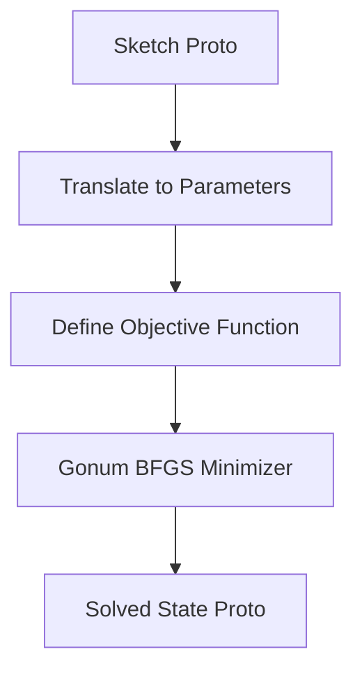

# BFGS Geometric Constraint Solver

## Objective
The BFGS solver is a **built-in, 100% Go solver** integrated directly into webcad.

### What it IS:
*   A lightweight, easy-to-compile solver designed to provide a baseline for webcad.
*   A testbed for demonstrating how CAD constraints (coincidence, distance, angle, etc.) are translated into mathematical residuals.

### What it IS NOT:
*   It does not use sparse matrix optimizations or advanced homotopy (global search) methods.
*   It lacks support for inequality constraints, check constraints, and advanced CAD features.

---

## Design & Architecture

The solver translates the geometric constraint graph into a continuous, non-linear optimization problem and solves it using gradient-based minimization.

### 1. Parameter Mapping
The solver extracts all independent degrees of freedom (coordinates of points, radii of circles, etc.) from the active entities and maps them to a flat, 1D real-valued parameter vector $\mathbf{x} \in \mathbb{R}^N$.
*   A `Point` contributes 2 parameters ($x, y$).
*   A `Line` contributes 4 parameters ($x_1, y_1, x_2, y_2$).
*   Free variables are optimized; fixed variables are projected out.

### 2. Objective Function (Least Squares)
The solver defines a scalar objective function $f(\mathbf{x}): \mathbb{R}^N \to \mathbb{R}$ representing the "total violation" of the system:
$$f(\mathbf{x}) = \sum_{i=1}^{M} r_i(\mathbf{x})^2$$
where $r_i(\mathbf{x})$ is the **residual error** of the $i$-th constraint (calculated via `go/solvers/core/evaluator.go`).
*   **Coincidence (Point-Point)**: $r = \sqrt{(x_2-x_1)^2 + (y_2-y_1)^2}$ (Euclidean distance).
*   **Distance**: $r = |d_{\text{actual}} - d_{\text{target}}|$.
*   The solver aims to find $\mathbf{x}^*$ such that $f(\mathbf{x}^*) \approx 0$.

### 3. Minimization (BFGS)
Minimization is performed using the **BFGS (Broyden–Fletcher–Goldfarb–Shanno)** quasi-Newton method provided by the `gonum.org/v1/gonum/optimize` package.
*   BFGS approximates the Hessian matrix of second derivatives, offering superlinear convergence.
*   A robust line search is used to ensure stable descent steps.

### 4. Gradients
The solver supports both analytical and numerical gradients:
*   **Analytical Gradients (Default)**: Uses the analytical gradients computed by the constraint evaluators in `go/core/constraints`. This is much faster and more accurate.
*   **Numerical Gradients**: Computes the gradient $\nabla f(\mathbf{x})$ numerically using central differences. Useful for verification or if analytical gradients are missing.

---

## Special Constraint Handling

### 1. `Fixed` Constraints ($O(1)$ Overhead)
Rather than adding heavy penalty terms to the objective function (which makes the surface "stiff" and hard to optimize), `Fixed` constraints are handled via **parameter projection**:
*   During parameter mapping, any parameter belonging to a `Fixed` entity is **omitted** from the active optimization vector $\mathbf{x}$.
*   When evaluating the objective function, these parameters are injected back as constants.
*   This reduces the dimensionality of the problem and guarantees that fixed entities *never* drift, with zero optimization overhead.

### 2. `Concentric` Constraints
Evaluated as the Euclidean distance between the centers of the two entities. If one entity is a Point and the other is a Circle, it constrains the point to lie exactly at the circle's center.
