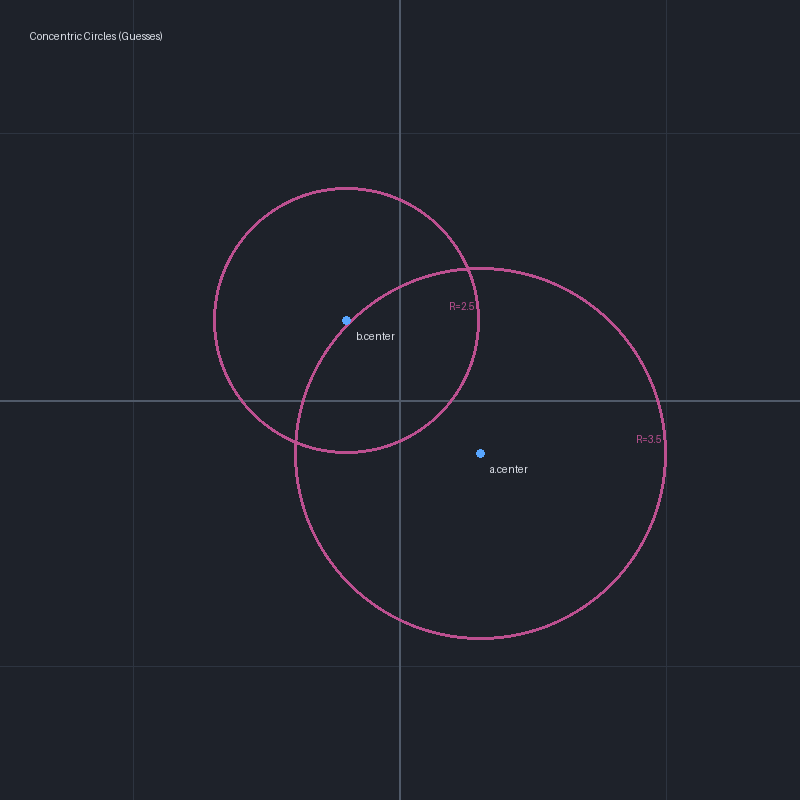
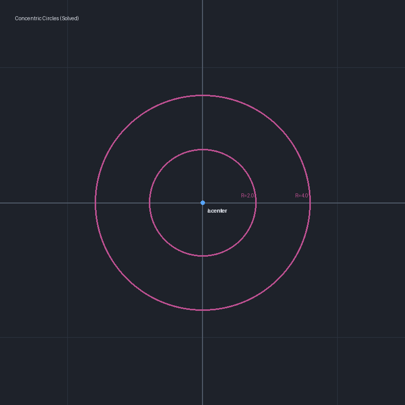
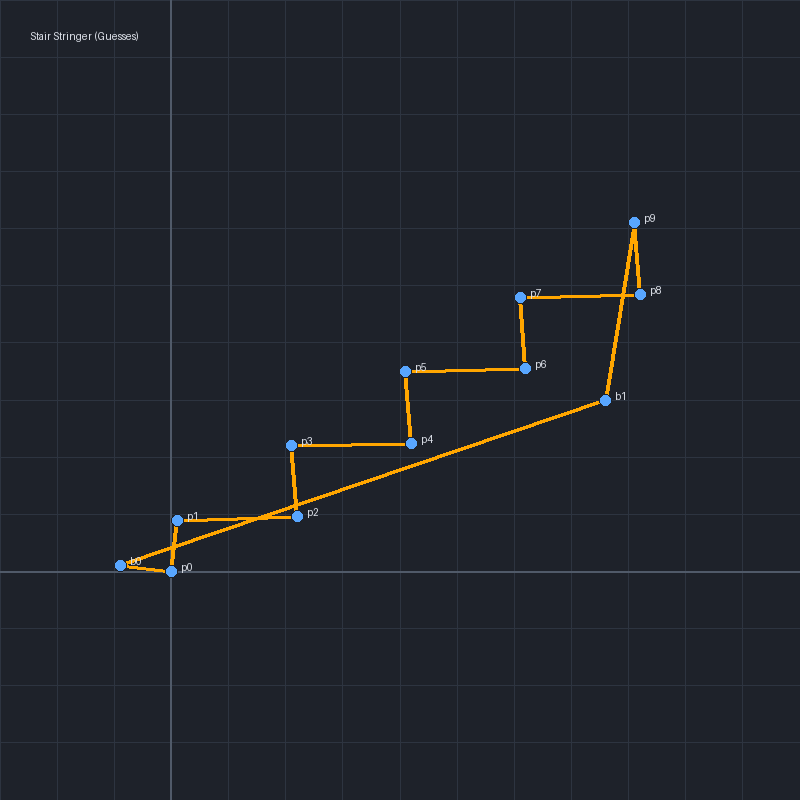
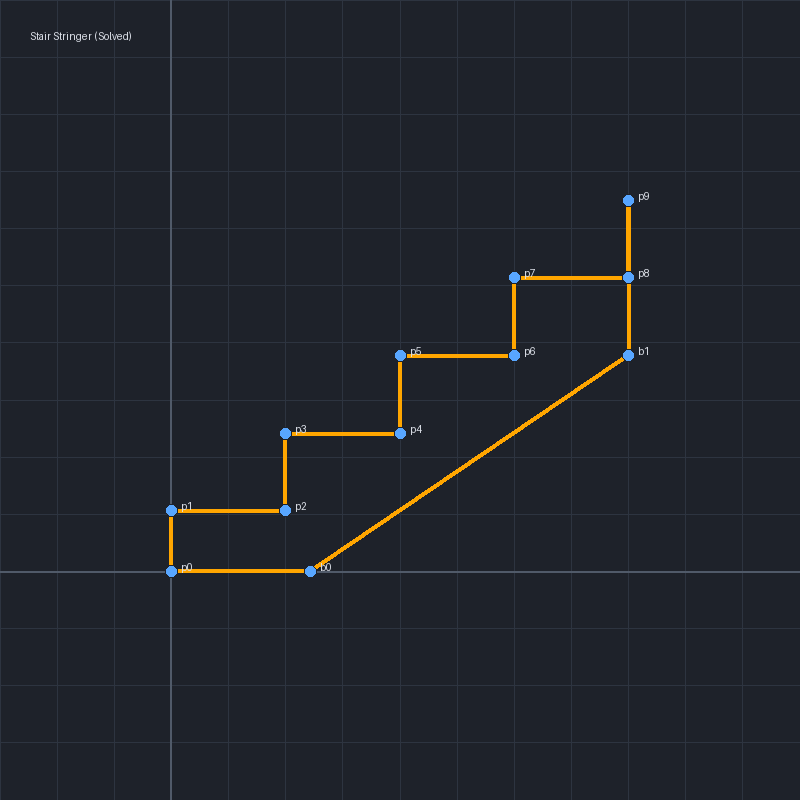

# ezpz Solver Examples

This directory contains example problem files and visualizations for the `ezpz` geometric constraint solver.

---

## Example 1: Concentric Circles

This example constrains two circles to share the same center point at `(0, 0)` with specific radii:
*   **Circle `a`**: Radius = `4.0`
*   **Circle `b`**: Radius = `2.0`
*   **Initial Guesses**: The initial center guesses are deliberately misaligned (`a` at `(1.5, -1.0)`, `b` at `(-1.0, 1.5)`).

### Visualizations

#### Guesses (Before)


#### Solved (After)


### How to Run Yourself
Solve the problem and print the resolved coordinates:
```bash
bazel run @ezpz//ezpz-cli:ezpz-cli -- --filepath third_party/ezpz/examples/concentric.md --show-points
```

---

## Example 2: Stair Stringer

This example models a 2D stair stringer cut from a standard **2x12 board** (actual width = `11.25"`):
*   **Total Rise**: `34.0"` over **5 risers**.
*   **Step Height (Rise)**: `34" / 5 = 6.8"`.
*   **Tread Run (Depth)**: `10.0"`.
*   **Tread Thickness adjustment**: `3/4" subfloor + 3/4" finished flooring = 1.5"`.
    *   **Bottom Riser Height**: Adjusted to `6.8" - 1.5" = 5.3"` (to account for the bottom tread thickness resting on the floor).
    *   **Top Riser Height**: Lands at `32.5"` at the top of the stringer, which reaches exactly `34.0"` once the finished floor is installed on top.
*   **Bottom Cut**: Level cut horizontally to rest on the floor.
*   **Top Cut**: Plumb cut vertically to rest against the header.
*   **2x12 Lumber Geometry**: The bottom edge is constrained parallel to the stair slope at a perpendicular width of `11.25"`.

### Visualizations

#### Guesses (Before)


#### Solved (After)


### How to Run Yourself
Solve the problem and print the resolved coordinates:
```bash
bazel run @ezpz//ezpz-cli:ezpz-cli -- --filepath third_party/ezpz/examples/stair_stringer.md --show-points
```
