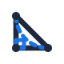
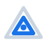
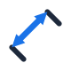
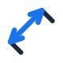
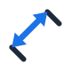
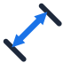
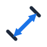
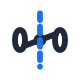

# Alternative SVG Icon Designs (Visual Catalog)

This catalog displays rendered SVG design variations for each WebCAD toolbar icon.

---

## 0. WebCAD Logo Ideas

*   **Logo Option 1: Monogram "W" with point constraint nodes**
    
*   **Logo Option 2: Parametric Drafting Compass drawing a circle**
    
*   **Logo Option 3: Nested Parametric Cube (Drafting Grid)**
    
*   **Logo Option 4: Parametric Triangle with Right Angle & Perpendicular Constraint**
    
*   **Logo Option 5: Intersecting Spline and Tangent Line**
    
*   **Logo Option 6: Nested Isometric Hexagons (No Axis Lines)**
    
*   **Logo Option 7: Nested Isometric Triangles**
    
*   **Logo Option 8: Overlapping Isometric Planes (Translucent)**
    
*   **Logo Option 9: Abstract Isometric "W" Shape**
    
*   **Logo Option 10: Geometric Monogram "WC" (Sleek curve)**
    
*   **Logo Option 11: Drafting Compass & Arc (Clean, no axis)**
    
*   **Logo Option 12: Venn Constraint (Circle & Square Intersecting)**
    
*   **Logo Option 13: Infinite Constraint Loop**
    
*   **Logo Option 14: Blueprint "W" in Target Circle**
    
*   **Logo Option 15: Clean 3D Coordinate Node (Floating Ring)**
    

---

## 1. Select Icon Options

*   **Option 1: Filled Pointer Arrow (Current)**
    
*   **Option 2: Outline Pointer Arrow**
    
*   **Option 3: Pointer with Selection Window**
    
*   **Option 4: Hand Grab Pointer**
    
*   **Option 5: Precision Crosshair Pointer**
    

---

## 2. Point Icon Options

*   **Option 1: Simple Solid Dot (Current)**
    
*   **Option 2: Center Dot with Crosshairs**
    
*   **Option 3: Circle with Center Point**
    
*   **Option 4: Plus Mark (+)**
    
*   **Option 5: Square Point Node**
    

---

## 3. Line Icon Options

*   **Option 1: Segment with Endpoint Nodes (Current)**
    
*   **Option 2: Segment with Hollow Vertices**
    
*   **Option 3: Polyline (Connected Segments)**
    
*   **Option 4: Line Vector with Arrow**
    
*   **Option 5: Simple Line Segment**
    

---

## 4. Circle Icon Options

*   **Option 1: Center Point & Dashed Radius (Current)**
    
*   **Option 2: Circle with Hollow Center Point**
    
*   **Option 3: Circle with Solid Center Point**
    
*   **Option 4: Simple Outer Circle Outline**
    
*   **Option 5: Center Crosshair Circle**
    

---

## 5. Dimension Icon Options

### Horizontal / Style Variations

*   **Option 1: Classic Flush Filled Arrows**
    
*   **Option 2: Tiny Gap at Arrowhead Tips**
    
*   **Option 3: Overlapping/Crossing Arrowhead Tips**
    
*   **Option 4: Long/Sharp Filled Arrowheads**
    
*   **Option 5: Short/Stubby Filled Arrowheads**
    
*   **Option 6: Outline Arrows with Gap**
    
*   **Option 7: Outline Arrows Flush**
    
*   **Option 8: Overshooting Dimension Line (Open Arrows)**
    
*   **Option 9: Extra Short Witness Lines**
    
*   **Option 10: Taller Witness Lines with Extension**
    

### Diagonal Aligned Variations (Visual-Match Series)

*   **Option 20: Classic Aligned (Current Default), Blue Arrow, Filled**
    
*   **Option 21: Aligned, Monochrome, Filled**
    
*   **Option 22: Aligned, Blue, Outline Arrows (Open tips)**
    
*   **Option 23: Aligned, Monochrome, Outline Arrows**
    
*   **Option 24: Aligned, Extra Long/Sharp Arrowheads, Blue**
    
*   **Option 25: Aligned, Short/Stubby Arrowheads, Blue**
    
*   **Option 26: Aligned, Overshooting Witness Lines**
    
*   **Option 27: Aligned, Offset Dimension Line (arrow closer to baseline)**
    
*   **Option 28: Aligned, Architectural Slash / Tick, Blue**
    
*   **Option 29: Aligned, Broken Line with Value Label (Monochrome)**
    

---

## 6. Rectangle Icon Options

*   **Option 1: Corner Rectangle (Blue Corners)**
    
*   **Option 2: Corner Rectangle (Monochrome)**
    
*   **Option 3: Center Point Rectangle**
    
*   **Option 4: Outline Rectangle**
    
*   **Option 5: Slanted 3-Point Rectangle**
    
*   **Option 6: Fillet Corner Rectangle**
    
*   **Option 7: Parallelogram**
    
*   **Option 8: Chamfered Corner Rectangle**
    
*   **Option 9: Concentric Rectangles**
    
*   **Option 10: Rounded Rectangle**
    

---

## 7. Arc Icon Options

*   **Option 1: 3-Point Arc (Blue Nodes)**
    
*   **Option 2: Center Point Arc (Blue Accent)**
    
*   **Option 3: Tangent Arc to Line**
    
*   **Option 4: 3-Point Arc (Monochrome)**
    
*   **Option 5: Center Point Arc (Monochrome)**
    
*   **Option 6: Arc Segment Outline**
    
*   **Option 7: S-Curve Arc**
    
*   **Option 8: Arc with Arrow Indicator**
    
*   **Option 9: Semi-Circle Segment**
    
*   **Option 10: Elliptical Arc**
    

---

## 8. Coincident Icon Options

*   **Option 1: Point on Line Segment (Blue)**
    
*   **Option 2: Point on Line Segment (Monochrome)**
    
*   **Option 3: Point on Circle Boundary**
    
*   **Option 4: Point on Line T-Junction**
    
*   **Option 5: Shared End Vertex**
    
*   **Option 6: Shared Center Node**
    
*   **Option 7: Intersection Coincident Node**
    
*   **Option 8: Point on Spline**
    
*   **Option 9: Point on Tangent Line**
    
*   **Option 10: Hollow Coincident Ring**
    

---

## 9. Concentric Icon Options

*   **Option 1: Concentric Rings & Center Dot (Blue)**
    
*   **Option 2: Concentric Rings & Center Dot (Monochrome)**
    
*   **Option 3: Concentric Reference Ring (Dashed)**
    
*   **Option 4: Target Concentric Circles**
    
*   **Option 5: Arc Concentric to Circle**
    
*   **Option 6: Concentric Squares**
    
*   **Option 7: Concentric Ripples**
    
*   **Option 8: Concentric Ellipses**
    
*   **Option 9: Concentric Arcs**
    
*   **Option 10: Concentric Rings with Axis lines**
    

---

## 10. Parallel Icon Options

*   **Option 1: Parallel slashes on Slanted Lines**
    
*   **Option 2: Vertical Parallel Lines**
    
*   **Option 3: Horizontal Parallel Lines**
    
*   **Option 4: Slanted Parallel Lines (Monochrome)**
    
*   **Option 5: Parallel Line Blue Accent**
    
*   **Option 6: Multi-Parallel Lines**
    
*   **Option 7: Parallel Slanted Lines with Arrows**
    
*   **Option 8: Parallel Curved Arcs**
    
*   **Option 9: Parallel Lines with Offset Line**
    
*   **Option 10: Infinite Parallel Lines**
    

---

## 11. Perpendicular Icon Options

*   **Option 1: T-Shape with Blue Corner Box**
    
*   **Option 2: L-Shape with Blue Corner Box**
    
*   **Option 3: Slanted Lines with Corner Box**
    
*   **Option 4: T-Shape (Monochrome)**
    
*   **Option 5: L-Shape (Monochrome)**
    
*   **Option 6: Perpendicular crosshairs**
    
*   **Option 7: Intersecting lines with Corner Box**
    
*   **Option 8: Perpendicular Bisector**
    
*   **Option 9: Circle normal line**
    
*   **Option 10: Normal Vector arrow**
    

---

## 12. Tangent Icon Options

*   **Option 1: Line tangent to Circle (Blue mark)**
    
*   **Option 2: Vertical Line tangent to Circle**
    
*   **Option 3: Horizontal Line tangent to Circle**
    
*   **Option 4: Tangent Circles (External contact)**
    
*   **Option 5: Tangent Arc to Line**
    
*   **Option 6: Monochrome Line-Circle Tangent**
    
*   **Option 7: Tangent Circles (Internal contact)**
    
*   **Option 8: Tangent Spline curve**
    
*   **Option 9: Double Tangent Line**
    
*   **Option 10: Tangent Arcs (S-Curve)**
    

---

## 13. Horizontal Icon Options

*   **Option 1: Horizontal Line & Blue Level Bar**
    
*   **Option 2: Horizontal line with Arrows**
    
*   **Option 3: Horizontal line with Center bubble**
    
*   **Option 4: Horizontal line (Monochrome)**
    
*   **Option 5: Ground line hatch**
    
*   **Option 6: Horizontal Line with Alignment nodes**
    
*   **Option 7: Horizontal Dashed Centerline**
    
*   **Option 8: Horizon curve**
    
*   **Option 9: Horizontal Line with parallel ticks**
    
*   **Option 10: Horizontal alignment arrow**
    

---

## 14. Vertical Icon Options

*   **Option 1: Vertical Line & Blue Level Bar**
    
*   **Option 2: Vertical line with Arrows**
    
*   **Option 3: Vertical line with Center bubble**
    
*   **Option 4: Vertical line (Monochrome)**
    
*   **Option 5: Vertical Line with Alignment nodes**
    
*   **Option 6: Vertical Dashed Centerline**
    
*   **Option 7: Vertical Wall hatch**
    
*   **Option 8: Vertical alignment arrow**
    
*   **Option 9: Vertical Line with parallel ticks**
    
*   **Option 10: Vertical block pillar**
    

---

## 15. Trim Icon Options

*   **Option 1: Scissors cutting dashed segment (Blue)**
    
*   **Option 2: Scissors cutting solid line**
    
*   **Option 3: Scissors cutting arc**
    
*   **Option 4: Eraser wiping line segment**
    
*   **Option 5: X-Mark cutting line**
    
*   **Option 6: Scissors cutting circle**
    
*   **Option 7: Split line with gap**
    
*   **Option 8: Scissors (Monochrome)**
    
*   **Option 9: Cutting blade segment**
    
*   **Option 10: Scissors cutting corner**
    
